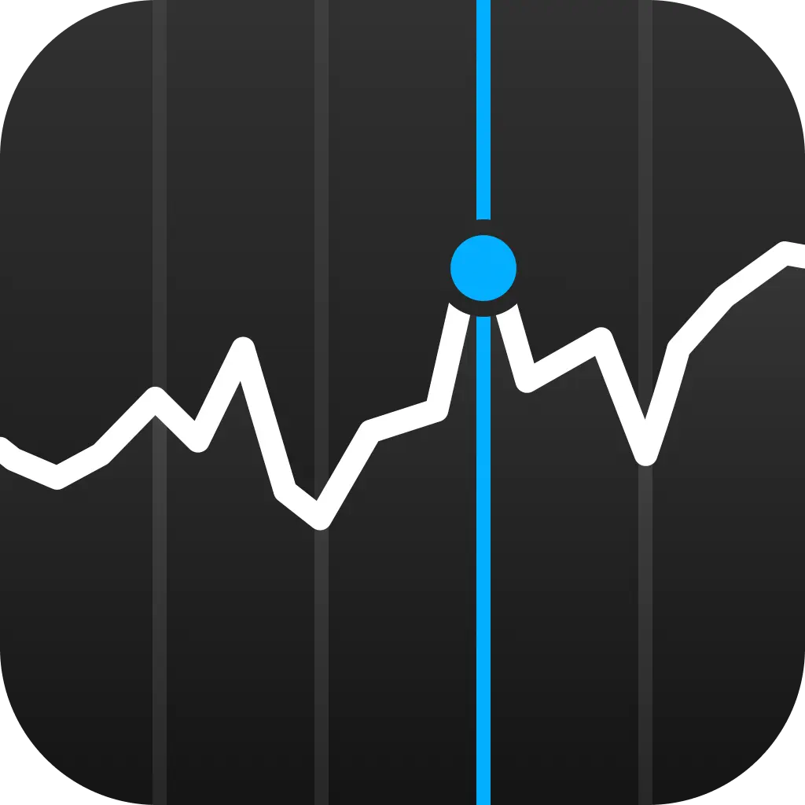
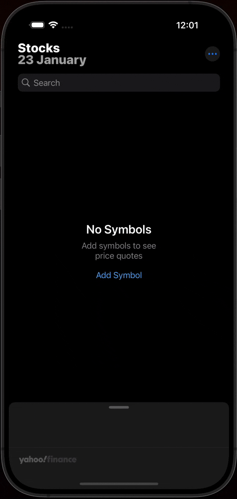
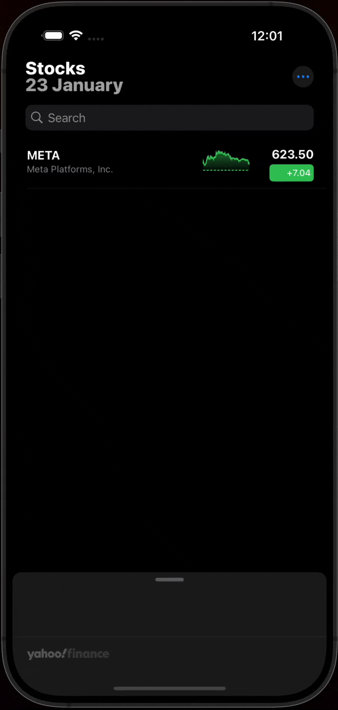
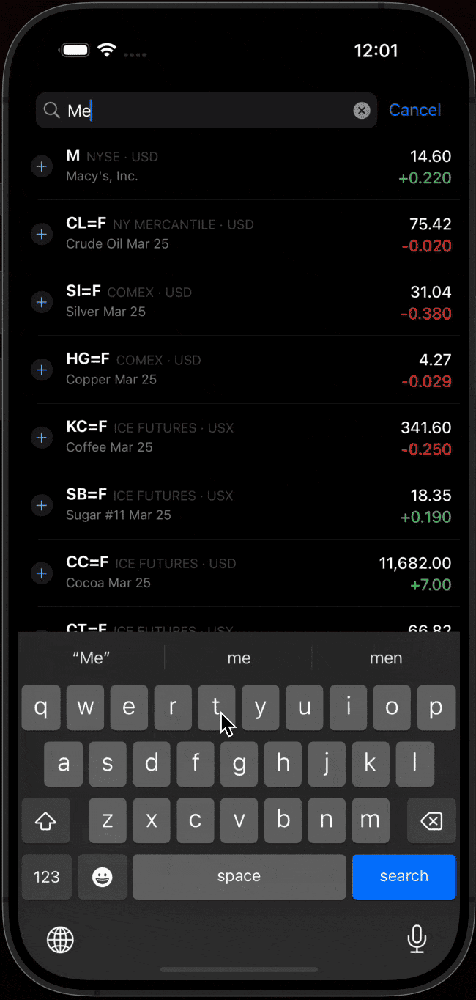
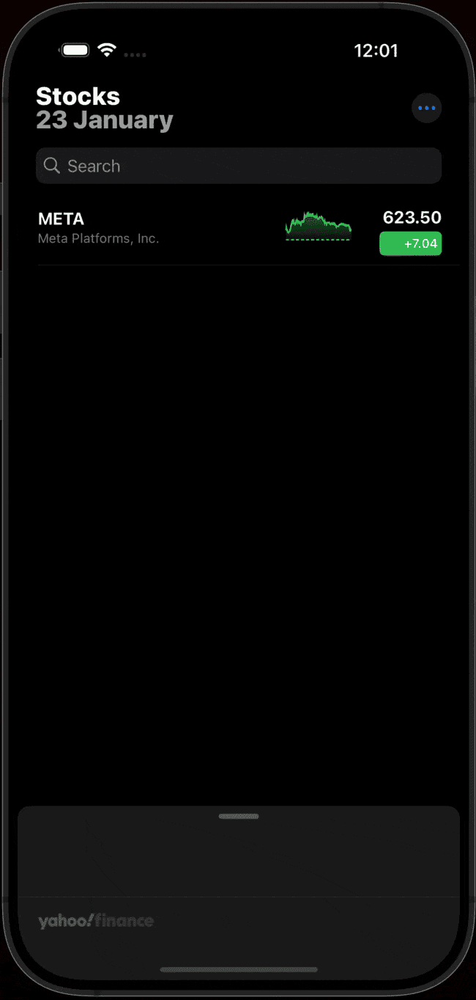
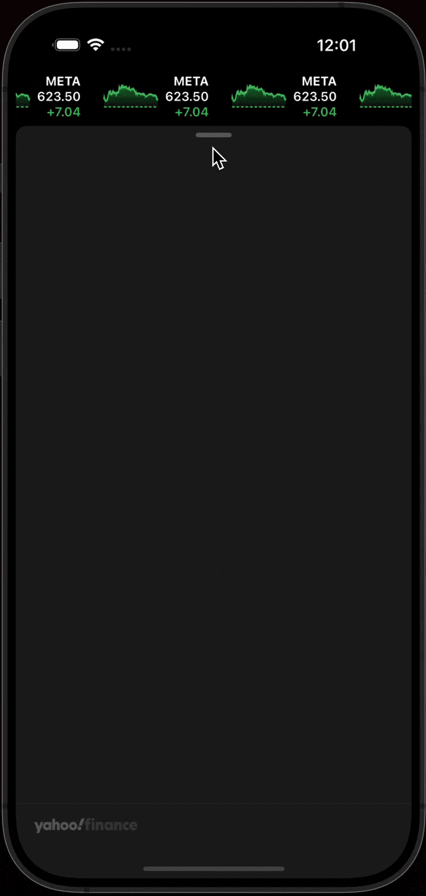

   

## Overview (Work in Progress)

 
 
 
 
 
 

This repository contains the **Stocks Application**, a project inspired by the Apple Stocks app. The app is currently **under development** and **not yet complete**.  

## Status 🚧 
The project is a **work in progress**, and several features are still being built and tested. Expect ongoing updates as development continues.

## Implemented Features
- **Watchlist**: View and manage your favorite stocks along with their corresponding charts.  
- **Charts and Graphs**: Explore real-time stock chart visualizations.  
- **Search for Stocks**: Easily search and find stocks in real-time.  
- **Stocks Header with Infinite Collection**: An interactive header displaying a scrolling collection of added stock charts.  

## What's Next?
**Upcoming updates will include:**  
  - **Market data integration** for enhanced stock insights.  
  - **News integration** for stocks to keep you informed.  
  - **Interactive charts and graph details** for deeper analysis.  
  
Feel free to explore the repository, but keep in mind that the app is still in development and not yet ready for production use. Feedback and suggestions are always welcome!
